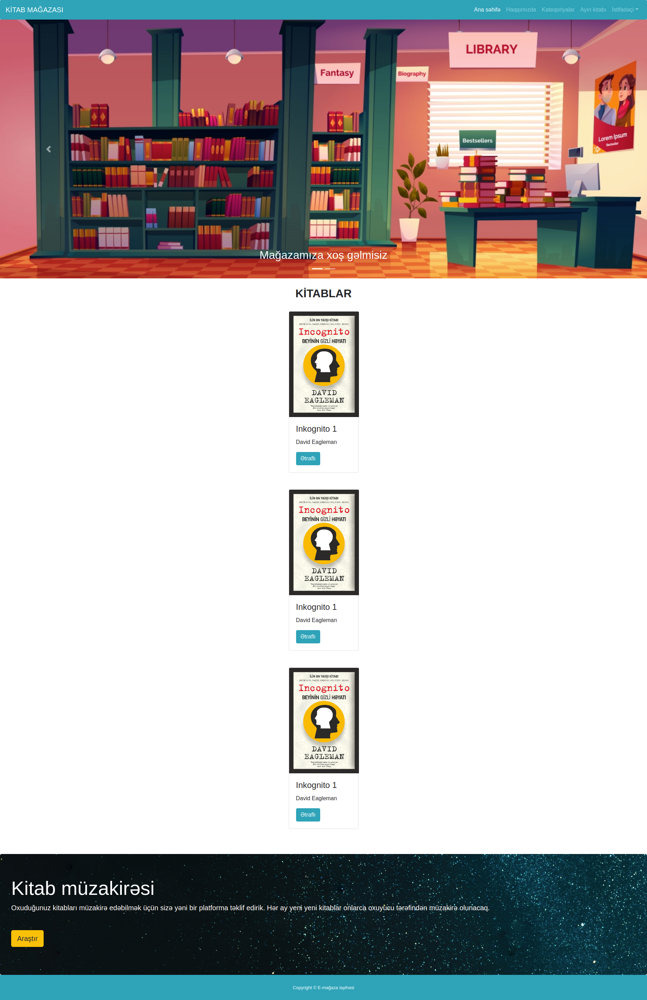
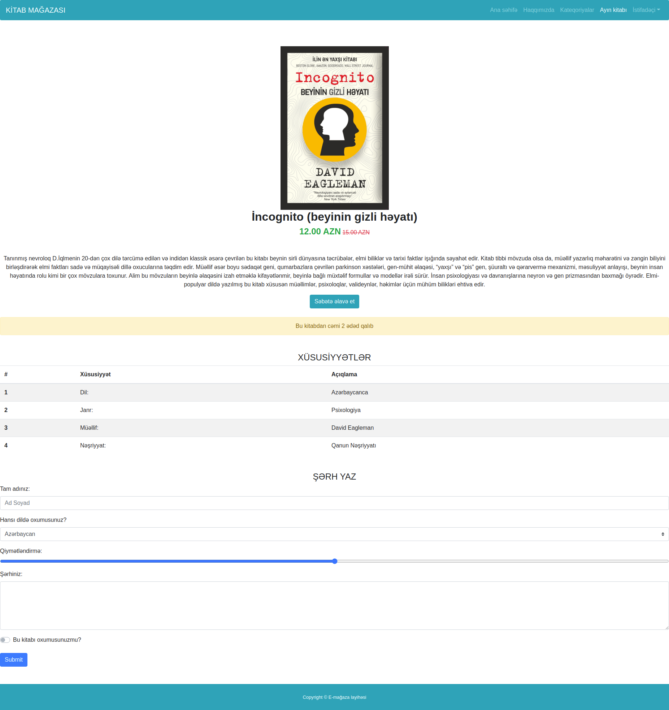

## E-commerce website

### 7.day tasks

#### In today's tasks, the product page and homepage will be created using only Bootstrap classes

#### Home Tasks
* The menu should be prepared as shown, the Ana səhifə should be active. (Bootstrap nav)
* A slider containing 2 slides must be prepared, the images are given in the images folder. (Bootstrap carusel)
* 3 cards must be prepared, including the picture, name, author and button of the book. (Bootstrap card)
* These cards must be averaged on page.
* A jumbotron should be made as shown in the picture, inline css can be used to place the picture in the background
* Footer part must also be made with bootstrap classes.

#### Product Page Tasks
* The menu should be prepared as shown, Ayın kitabı should be active. (Bootstrap nav)
* Menu Ana səhifə, Ayın kitabı sections should be active and redirected to the appropriate pages.
* The picture, title, price, content of the book, the button should come upside down and average. These should only be done using bootstrap classes.
* Bootstrap alert, Bootstrap table, Bootstrap form should be used in the following sections, respectively.
* CSS code cannot be used to create the page.

#### Questions
* Write your answers to the answers.txt file in this folder.
* Explain in your own words, in your own language
* What is Bootstrap?
* How is it works?
* Could you create package like Bootstrap? How?

<a href="https://www.figma.com/file/pZOm7mijB58yylkX5b8uMF/Untitled?node-id=1%3A2">Home page figma file.</a>

<a href="https://www.figma.com/file/kXMrJTaCTFECGAdZBqRSgZ/Untitled?node-id=1%3A2">Product page figma file.</a>

### Home page

### Product page

